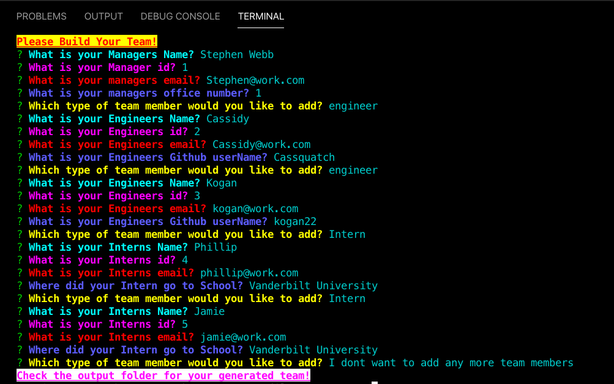

# Team-Profile-Generator
A software engineering team generator command line application utilizing node.js.




## How To Use
Run this command in your Command line
```
node app.js
```
* Fill in the Manager prompts
* Select as many Engineers/Interns you would like to add to your team
* Fill in the information for selections
* When finished select "I dont want to add anymore team members"
* Navigate to the output folder and you will have a beautifully generated Html file of your team!

## Technologies Used
* Node.js
* JavaScript
* OOP
* bootstrap
* CSS

# Dependencies
* Chalk
* fs
* jest
* inquirer
 
  

